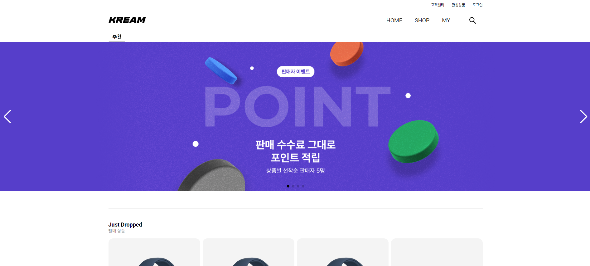

# 🖼 KREAM


## <strong>Installation</strong>

```
npm i
npm start
```

## <strong>개요</strong>

- [크림(Kream)](https://kream.co.kr/) 웹사이트 클론코딩 프로젝트 입니다.
- 클론코딩은 개발 환경 셋팅부터 시작하였습니다.
- 프로젝트는 11일동안 진행됨에 따라 디자인과 아래 서술한 기능들만 선택하여 구현했습니다.

## <strong>팀원</strong>

`Front-End`

- 윤현호, 곽희빈

`Back-End`

- 김유진, 한지우

## <strong>사용 기술</strong>

`Front-End` : React, javascript, CSS, Axios, Recoil, styled-components, Material-ui </br>
`Back-End` : Java, Spring </br>
`Cowork` : Git, Slack, Notion

### <strong>개발 및 기획 과정</strong>


### <strong>폴더 구조</strong>
```
├── ...                   
├── src           
	├── atoms         # recoil 상태 관리
	├── common        # 공용 
	├── components    # 컴포넌트
	├── module        # Axios
	├── page          # 페이지 단위 컴포넌트
	├── App.jsx        
	└── index.jsx      
├── README.md               
└── ...
```

## <strong> 프로젝트 상세내용 </strong>

- 개발기간: 2023.02.24 ~ 2023.04.20
- 주제 : 한정판 리셀(KREAM)
- 개발 : Visual Studio code
- 사용 언어 : React, CSS3, Javascript(ES6), React

> 사용자 페이지

- 상품 필터
- 검색
- 입찰 시스템 구현(구매입찰/판매입찰)
- 카카오 로그인
- 상품별 최근/평균 가격
- 관심상품

## <strong>리펙토링 예정(코드 및 버그 수정)</strong>

## <strong>담당한 파트(Front-End)</strong>

- UI
  - HeaDer
  - FooTer
  - Home
  - Shop
  - My => 내정보
- 기능
  - Shop
  - Home
  - 검색
  - My
    - 내정보

## <strong>프로젝트를 진행하면서 어려웠던점</strong>
  - 윤현호
    - 
    프로젝트를 급하게 진행하게 되면서 Front-End파트를 같이 진행하는 스터디원과
    원활하게 커뮤니케이션이 이루어지지 않아서 공통으로 저장하는 JS/CSS 파일을 만들어두고
    사용하지 않고 각자 만들어서 사용했던 부분들이 많이 생기면서 시간도 오래걸리게 되고
    충돌이 많이 생겨 그만큼 시간을 많이 잡아먹었던거 같습니다.

    처음 UI를 만들때 라이브러리를 사용하지않고 진행을 하게 되었는데 이후에 퍼블리싱 속도가 느려서 프로젝트를 진행하는 도중 Meterial-UI를 선택해서 진행하게 되었다. 처음에는 사용해보지 못해본 라이브러리를 배우면서 사용해보자는 취지로 시작했지만, 사용법이 생소하기도 하고, 시간이라는 압박에 사용을 잘 못했던거 같다.

    프로젝트 개발중 문제가 생기거나 git에 push와 merge를 할 때에 팀원과 소통이 많이 없었다보니 git에서는 자주 충돌이 나게 되었다. 나중에서야 branch를 하나 더 만들어서 한곳에서 merge를 하는 방법을 찾아서 진행하게 되었지만 처음 개발환경을 잘 만들어 두었다면 주어진 시간을 잘 활용할 수 있었다고 생각한다.


 <br/><br/>


## <strong>성장한 부분</strong>

- 윤현호(FE)
  - 
    처음 리엑트 프로젝트를 진행하게 되면서, 많은걸 배우게되고 습득하게되는 그런 프로젝트였습니다.
    
    개인적으로 경험이 많이 부족헀던 백엔드와 작업할 수 있었던 것이 정말 좋은 경헙이었습니다. 백엔드와 같이 협업하여 프로젝트를 진행하면서 다양한 HTTP요청 메서드를 쓰며 이해할 수 있었습니다.
    또한, 프론트와 백엔드가 어떤 커뮤니케이션을 하게 되는지 알게 되었고, 프론트로 전달되는 data에 대해 고민하여 서로 조율하며 맞춰가며 좀 더 나은 data모양에 대해서도 고민할 수 있는 기회가 되었다.

    상태 라이브러리는 Recoil을 사용했습니다. Recoil은 Redux에 비해 코드를 좀 더 직관적이게 사용할 수 있었고, 코드에 길이도 짧다는 장점이 있어서 사용했습니다.

    팀원들과 커뮤니케이션이 중요하다는걸 이번 프로젝트를 하면서 알게 되었습니다.
    개발을 하면서 기능을 다 만들고 프로젝트가 끝났다고 생각이 들었지만 테스트를 하게되면서 생각지 못한 부분에서 버그들이 발생한다는 것을 알게 되어서 그만큼 개발 기간을 타이트하게 잡으면 안된다는것을 알게되었습니다. 퍼블리셔로 직무를 할떄는 사용하지않았던  git 사용법과 react, js에 대한 이해도가 많이 늘었고, 잘하고 싶은 욕심도 많았기 때문에 여러가지 측면에서 아쉬움이 많이 남았던 프로젝트였던거 같다. 그래서 좀 더 나은 개발이 무엇인가 고민하게 되었고, 그에 대한 답은 정돈된 개발 체계와 속도, 정확성, 소통이라는 결론을 내렸다. 제한된 시간 안에 프로젝트를 끝내려면 나의 속도와 팀원의 속도를 알고 서로 부족한 부분을 보완하며 최적의 선택을 해야한다는 것을 배웠다. 팀원들이 힘들어도 포기하지 않고 함께 프로젝트를 마쳐주어서 고마웠다.
